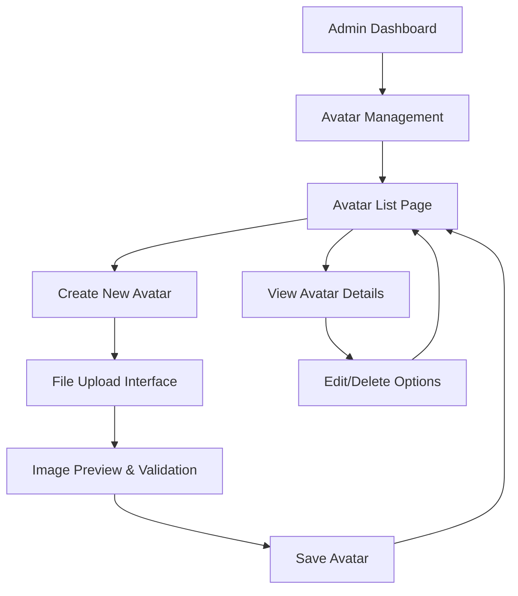

# Avatar Management Feature - Product Requirements Document

## 1. Product Overview
Implement a comprehensive avatar management system within the existing Laravel admin dashboard that allows administrators to upload, manage, and organize user avatars. This feature enables centralized control over avatar assets used throughout the application, providing a streamlined interface for avatar administration.

## 2. Core Features

### 2.1 User Roles
| Role | Registration Method | Core Permissions |
|------|---------------------|------------------|
| Admin | Existing admin authentication | Full avatar management access - create, view, edit, delete avatars |

### 2.2 Feature Module
Our avatar management requirements consist of the following main pages:
1. **Avatar List Page**: Display grid of existing avatars, search functionality, pagination, "Create New Avatar" button.
2. **Avatar Create Page**: File upload interface, image preview, form validation, save/cancel actions.
3. **Avatar Detail Page**: Full-size image display, metadata information, edit/delete options.

### 2.3 Page Details
| Page Name | Module Name | Feature description |
|-----------|-------------|---------------------|
| Avatar List Page | Avatar Grid Display | Display avatars in responsive grid layout with thumbnail previews, pagination controls, search/filter functionality |
| Avatar List Page | Action Controls | "Create New Avatar" button, bulk actions, individual avatar management options |
| Avatar Create Page | File Upload | Drag-and-drop file upload interface with image preview, file type validation (jpg, png, gif), size restrictions |
| Avatar Create Page | Form Validation | Real-time validation for file type, size limits, required fields with user-friendly error messages |
| Avatar Detail Page | Image Display | Full-size avatar preview with zoom functionality, metadata display (file size, dimensions, upload date) |
| Avatar Detail Page | Management Actions | Edit avatar details, delete confirmation modal, download original file option |

## 3. Core Process
**Admin Avatar Management Flow:**
1. Admin accesses avatar management from sidebar navigation
2. Views existing avatars in grid layout with search/filter options
3. Clicks "Create New Avatar" to upload new avatar
4. Selects image file through drag-and-drop or file browser
5. Previews image and confirms upload
6. System validates file and saves to storage with database record
7. Returns to avatar list with success confirmation
8. Can view, edit, or delete existing avatars as needed

## 4. User Interface Design

### 4.1 Design Style
- **Primary Colors**: Indigo (#4f46e5) for primary actions, Gray (#6b7280) for secondary elements
- **Secondary Colors**: Green (#10b981) for success states, Red (#ef4444) for delete actions
- **Button Style**: Rounded corners (rounded-md), consistent with existing Tailwind CSS design system
- **Font**: System font stack, text-sm for body text, text-lg for headings
- **Layout Style**: Card-based design with consistent spacing, responsive grid layout
- **Icons**: Font Awesome icons consistent with existing admin interface

### 4.2 Page Design Overview
| Page Name | Module Name | UI Elements |
|-----------|-------------|-------------|
| Avatar List Page | Header Section | Page title "Avatar Management", breadcrumb navigation, "Create New Avatar" button (indigo background, white text) |
| Avatar List Page | Grid Layout | Responsive grid (grid-cols-2 md:grid-cols-4 lg:grid-cols-6), card-based avatar thumbnails with hover effects |
| Avatar List Page | Avatar Cards | 150x150px thumbnails, file name overlay, action dropdown menu, consistent card styling with shadows |
| Avatar Create Page | Upload Area | Drag-and-drop zone with dashed border, file browser fallback, upload icon and instructional text |
| Avatar Create Page | Preview Section | Image preview container, file details display, progress indicator during upload |
| Avatar Detail Page | Image Display | Centered full-size image with max-width constraints, zoom functionality on hover |
| Avatar Detail Page | Metadata Panel | File information sidebar with creation date, file size, dimensions, download link |

### 4.3 Responsiveness
Desktop-first design with mobile-adaptive layout using Tailwind CSS responsive utilities. Touch interaction optimization for mobile devices with larger touch targets and swipe gestures for navigation.
