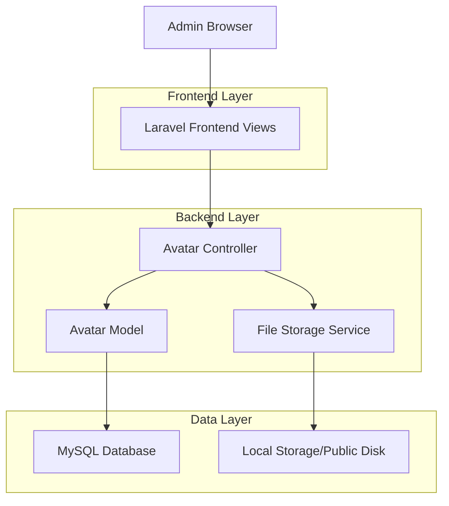
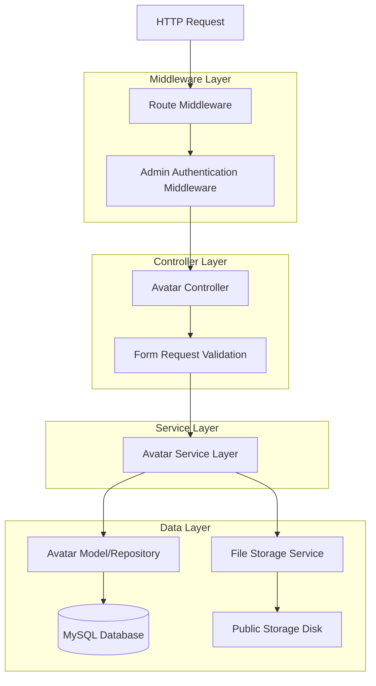
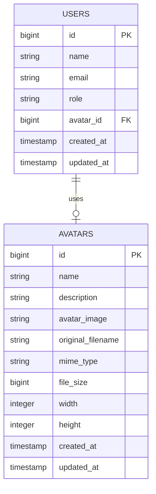

# Avatar Management Feature - Technical Architecture Document

## 1. Architecture Design



## 2. Technology Description

* Frontend: Laravel Blade Templates + Tailwind CSS + Font Awesome Icons

* Backend: Laravel 10+ Framework with MVC Architecture

* Database: MySQL (existing Laravel database)

* File Storage: Laravel Storage Facade with Public Disk

* Validation: Laravel Form Request Validation

## 3. Route Definitions

| Route                       | Purpose                                                |
| --------------------------- | ------------------------------------------------------ |
| /admin/avatars              | Avatar list page - displays all avatars in grid layout |
| /admin/avatars/create       | Avatar creation page - file upload interface           |
| /admin/avatars/store        | POST endpoint for saving new avatars                   |
| /admin/avatars/{id}         | Avatar detail page - view individual avatar            |
| /admin/avatars/{id}/edit    | Avatar edit page - modify avatar details               |
| /admin/avatars/{id}/update  | PUT endpoint for updating avatar                       |
| /admin/avatars/{id}/destroy | DELETE endpoint for removing avatar                    |

## 4. API Definitions

### 4.1 Core API Endpoints

**Avatar Creation**

```
POST /admin/avatars/store
```

Request (Multipart Form Data):

| Param Name    | Param Type | isRequired | Description                         |
| ------------- | ---------- | ---------- | ----------------------------------- |
| avatar\_image | file       | true       | Image file (jpg, png, gif, max 2MB) |
| name          | string     | false      | Optional custom name for avatar     |
| description   | string     | false      | Optional description                |

Response:

| Param Name | Param Type | Description           |
| ---------- | ---------- | --------------------- |
| success    | boolean    | Operation status      |
| message    | string     | Success/error message |
| avatar     | object     | Created avatar data   |

**Avatar Update**

```
PUT /admin/avatars/{id}/update
```

Request:

| Param Name    | Param Type | isRequired | Description               |
| ------------- | ---------- | ---------- | ------------------------- |
| name          | string     | false      | Updated avatar name       |
| description   | string     | false      | Updated description       |
| avatar\_image | file       | false      | New image file (optional) |

**Avatar Deletion**

```
DELETE /admin/avatars/{id}/destroy
```

Response:

| Param Name | Param Type | Description          |
| ---------- | ---------- | -------------------- |
| success    | boolean    | Deletion status      |
| message    | string     | Confirmation message |

## 5. Server Architecture Diagram



## 6. Data Model

### 6.1 Data Model Definition



### 6.2 Data Definition Language

**Avatars Table (avatars)**

```sql
-- Create avatars table migration
CREATE TABLE avatars (
    id BIGINT UNSIGNED AUTO_INCREMENT PRIMARY KEY,
    name VARCHAR(255) NULL,
    description TEXT NULL,
    avatar_image VARCHAR(500) NOT NULL,
    original_filename VARCHAR(255) NOT NULL,
    mime_type VARCHAR(100) NOT NULL,
    file_size BIGINT UNSIGNED NOT NULL,
    width INTEGER UNSIGNED NULL,
    height INTEGER UNSIGNED NULL,
    created_at TIMESTAMP NULL DEFAULT CURRENT_TIMESTAMP,
    updated_at TIMESTAMP NULL DEFAULT CURRENT_TIMESTAMP ON UPDATE CURRENT_TIMESTAMP
);

-- Create indexes for performance
CREATE INDEX idx_avatars_created_at ON avatars(created_at DESC);
CREATE INDEX idx_avatars_name ON avatars(name);
CREATE INDEX idx_avatars_mime_type ON avatars(mime_type);

-- Add avatar_id column to users table (optional future enhancement)
ALTER TABLE users ADD COLUMN avatar_id BIGINT UNSIGNED NULL;
ALTER TABLE users ADD FOREIGN KEY (avatar_id) REFERENCES avatars(id) ON DELETE SET NULL;
CREATE INDEX idx_users_avatar_id ON users(avatar_id);

-- Insert sample data (optional)
INSERT INTO avatars (name, description, avatar_image, original_filename, mime_type, file_size, width, height) VALUES
('Default Avatar 1', 'Default user avatar - neutral', 'avatars/default-avatar-1.png', 'default-avatar-1.png', 'image/png', 15420, 150, 150),
('Default Avatar 2', 'Default user avatar - professional', 'avatars/default-avatar-2.png', 'default-avatar-2.png', 'image/png', 18350, 150, 150),
('Default Avatar 3', 'Default user avatar - casual', 'avatars/default-avatar-3.png', 'default-avatar-3.png', 'image/png', 16780, 150, 150);
```

**Laravel Migration File Structure:**

```php
<?php
// database/migrations/2024_01_01_000001_create_avatars_table.php

use Illuminate\Database\Migrations\Migration;
use Illuminate\Database\Schema\Blueprint;
use Illuminate\Support\Facades\Schema;

return new class extends Migration
{
    public function up()
    {
        Schema::create('avatars', function (Blueprint $table) {
            $table->id();
            $table->string('name')->nullable();
            $table->text('description')->nullable();
            $table->string('avatar_image', 500);
            $table->string('original_filename');
            $table->string('mime_type', 100);
            $table->unsignedBigInteger('file_size');
            $table->unsignedInteger('width')->nullable();
            $table->unsignedInteger('height')->nullable();
            $table->timestamps();
            
            $table->index(['created_at']);
            $table->index(['name']);
            $table->index(['mime_type']);
        });
    }
    
    public function down()
    {
        Schema::dropIfExists('avatars');
    }
};
```

**Model Implementation:**

```php
<?php
// app/Models/Avatar.php

namespace App\Models;

use Illuminate\Database\Eloquent\Factories\HasFactory;
use Illuminate\Database\Eloquent\Model;
use Illuminate\Support\Facades\Storage;

class Avatar extends Model
{
    use HasFactory;
    
    protected $fillable = [
        'name',
        'description', 
        'avatar_image',
        'original_filename',
        'mime_type',
        'file_size',
        'width',
        'height'
    ];
    
    protected $casts = [
        'file_size' => 'integer',
        'width' => 'integer',
        'height' => 'integer',
        'created_at' => 'datetime',
        'updated_at' => 'datetime'
    ];
    
    // Accessor for full image URL
    public function getImageUrlAttribute()
    {
        return Storage::url($this->avatar_image);
    }
    
    // Accessor for formatted file size
    public function getFormattedFileSizeAttribute()
    {
        $bytes = $this->file_size;
        $units = ['B', 'KB', 'MB', 'GB'];
        
        for ($i = 0; $bytes > 1024; $i++) {
            $bytes /= 1024;
        }
        
        return round($bytes, 2) . ' ' . $units[$i];
    }
    
    
}
```

